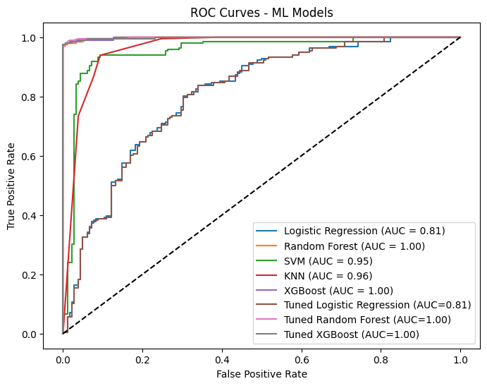

# Heart Disease Prediction using Machine Learning and Deep Learning Models

A comparative study of machine learning and deep learning models for predicting heart disease using clinical data.

> Developed as part of the **CSE427** course at **BRAC University**.

## At a Glance

- ❤️ **Application:** Heart Disease Prediction
- 📊 **Dataset:** 1,888 patient records
- 🎯 **Task:** Binary Classification
- 🤖 **Models:** Logistic Regression, KNN, SVM, Random Forest, XGBoost, and ANN
- 🏆 **Best Model:** Random Forest (98.41% Accuracy)

## Overview

Heart disease remains one of the leading causes of mortality worldwide, making early detection essential for improving treatment outcomes and supporting timely clinical decision-making. Recent advances in machine learning and deep learning have enabled the development of predictive models capable of identifying complex patterns within clinical data, offering valuable support for healthcare professionals.

This project presents a comparative study of multiple machine learning and deep learning models for heart disease prediction using a publicly available clinical dataset. The workflow includes data preprocessing, exploratory data analysis, feature scaling, hyperparameter tuning, model training, and comprehensive performance evaluation. By comparing the strengths and limitations of different approaches, the project aims to identify the most effective predictive model for heart disease classification..

## Project Objectives

The primary objectives of this project are to:

- Develop and evaluate machine learning and deep learning models for heart disease prediction using clinical data.
- Perform data preprocessing, feature scaling, and exploratory data analysis to prepare the dataset for model development.
- Apply hyperparameter tuning to selected machine learning models for performance optimization.
- Compare the performance of multiple classification algorithms using standard evaluation metrics, including Accuracy, Precision, Recall, F1-score, and ROC-AUC.
- Identify the most effective predictive model for reliable heart disease classification.


## Dataset

This project uses the **Kaggle Heart Disease Prediction Dataset**, which combines patient records from multiple publicly available cardiovascular disease datasets. The dataset contains demographic and clinical attributes commonly associated with heart disease risk and is used to perform binary classification for heart disease prediction.

| Attribute | Description |
|-----------|-------------|
| **Total Samples** | 1,888 |
| **Input Features** | 14 |
| **Target Variable** | Heart Disease |
| **Problem Type** | Binary Classification |
| **Dataset Source** | Kaggle Heart Disease Prediction Dataset |

### Features

The dataset includes the following clinical attributes:

- Age
- Sex
- Chest Pain Type
- Resting Blood Pressure
- Cholesterol
- Fasting Blood Sugar
- Resting ECG
- Maximum Heart Rate
- Exercise-Induced Angina
- ST Depression (Oldpeak)
- Slope of the ST Segment
- Number of Major Vessels (CA)
- Thalassemia
- Target (Heart Disease)


## Methodology

The project follows a structured machine learning workflow, starting from data preparation and ending with comparative model evaluation.

### Exploratory Data Analysis (EDA)

The dataset was explored using descriptive statistics and visualization techniques to understand feature distributions, class balance, and relationships between clinical variables.

### Data Preprocessing

The preprocessing pipeline included:

- Data inspection and validation
- Feature type identification
- Exploratory visualizations
- Feature standardization using `StandardScaler`

### Dataset Splitting

The processed dataset was divided into:

- **Training Set:** 80%
- **Testing Set:** 20%

A stratified train-test split was applied to preserve the class distribution.

### Model Development

The following predictive models were implemented and evaluated:

#### Machine Learning Models

- Logistic Regression
- K-Nearest Neighbors (KNN)
- Support Vector Machine (SVM)
- Random Forest
- XGBoost

#### Deep Learning Model

- Artificial Neural Network (ANN)

### Hyperparameter Tuning

GridSearchCV with 5-fold cross-validation was applied to optimize the following models:

- Logistic Regression
- Random Forest
- XGBoost

### Performance Evaluation

The models were evaluated using:

- Accuracy
- Precision
- Recall
- F1-score
- ROC-AUC
- Confusion Matrix

## Experimental Results

Six predictive models were trained and evaluated to compare the effectiveness of machine learning and deep learning techniques for heart disease prediction. The evaluation was performed using Accuracy, Precision, Recall, F1-score, ROC-AUC, and confusion matrices.

| Model | Accuracy |
|:------|---------:|
| Logistic Regression | 96.83% |
| K-Nearest Neighbors (KNN) | 96.56% |
| Support Vector Machine (SVM) | 97.35% |
| Random Forest | **98.41%** |
| XGBoost | 97.88% |
| Artificial Neural Network (ANN) | 94.51% |

### ROC Curve Comparison

<p align="center">
  
</p>

<p align="center"><em>Figure 2. ROC curve comparison of all evaluated models.</em></p>


Among all evaluated models, **Random Forest** achieved the highest overall performance with an accuracy of **98.41%**, outperforming both the other machine learning models and the deep learning model (ANN). These results demonstrate that ensemble-based methods can be highly effective for structured clinical datasets.

## Key Findings

- **Random Forest** achieved the highest predictive performance with an accuracy of **98.41%**, outperforming all other evaluated models.
- Classical machine learning models consistently outperformed the deep learning model (ANN) on this medium-sized structured clinical dataset.
- Hyperparameter tuning did not improve the performance of the tuned machine learning models, indicating that the default Random Forest configuration already provided strong generalization.
- The results suggest that ensemble-based machine learning approaches can be highly effective for heart disease prediction while remaining computationally efficient and easier to interpret than deep learning models for structured tabular data.

## Future Work

Potential directions for extending this project include:

- Evaluate the models on larger and more diverse clinical datasets to improve generalizability.
- Validate the proposed models using external datasets from different healthcare sources.
- Explore advanced ensemble and hybrid machine learning–deep learning approaches for improved predictive performance.
- Investigate explainable AI (XAI) techniques to improve model interpretability in clinical decision support.
- Develop a deployment-ready application that enables real-time heart disease risk prediction.

## Tech Stack

**Programming Language**

- Python

**Development Environment**

- Jupyter Notebook

**Libraries**

- Pandas
- NumPy
- Matplotlib
- Seaborn
- Scikit-learn
- TensorFlow / Keras
- XGBoost

## Repository Structure

```text
heart-disease-prediction/
│
├── data/
│   ├── raw/
│   └── processed/
│
├── notebooks/
│   └── heart_disease_prediction.ipynb
│
├── report/
│   └── heart_disease_prediction_report.pdf
│
├── images/
│   ├── eda/
│   └── results/
│
├── README.md
├── requirements.txt
└── .gitignore
```

## Acknowledgements

This project was developed as part of the **CSE427 - Machine Learning** course at **BRAC University**.

## Author

**Alena Halder Tamo**

B.Sc. in Computer Science and Engineering  
BRAC University

- GitHub: https://github.com/alena-tomo